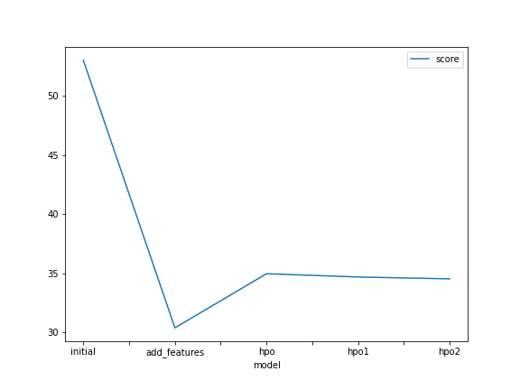
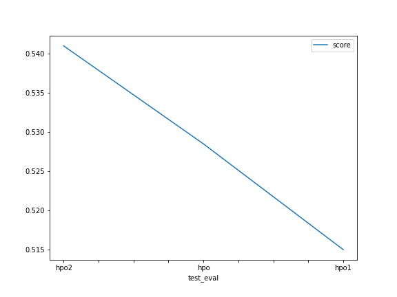

# Report: Predict Bike Sharing Demand with AutoGluon Solution
#### SARTHAK KAPALIYA

## Initial Training
### What did you realize when you tried to submit your predictions? What changes were needed to the output of the predictor to submit your results?
Five different experiments were performed as follows:
1. Initial Raw Model
2. EDA Model
3. first Hyperparameter model
4. second hyperparameter model
5. third hyperparameter model

obs: While submitting to raw model it acheived very poor performance and high Kaggle Score but for better performance we need low kaggle score.
Changes incorporated: Kaggle refuses the submissions containing negative predictions values obtained from the predictor. Hence, all such negative outputs from respective predictors were replaced with 0.

### What was the top ranked model that performed?
The Hperparameter model Second was top one as it has Kaggle score `0.51496` and RMSE score `34.674132`.

## Exploratory data analysis and feature creation
### What did the exploratory analysis find and how did you add additional features?
- We created new features like hour,day,month etc to add in the dataset. 
- Also There were various categorical feature which were in INT data type. We converted them into category data type using as_type function.
- Removed Casual and Registered columns as it was not present in Test dataset and had no importance in model training.
- Further, data visualization was conducted to derive insights from the features

### How much better did your model preform after adding additional features and why do you think that is?
In Raw model, The rmse score was 53.032149 and kaggle score was  1.79088. But after careful EDA and additional columns, we got Kaggle score of 
0.65951 which is better than before. this was results of Exploratory Data analysis and Data visualization

## Hyper parameter tuning
### How much better did your model preform after trying different hyper parameters?
The performance of the model was improved over the model's original submission thanks to hyperparameter adjustment. Hyperparameter optimisation tests were conducted using three distinct setups. The model with EDA and extra features performed significantly better on the Kaggle (test) dataset, despite hyperparameter optimised models delivering competitive performances in comparison.

### If you were given more time with this dataset, where do you think you would spend more time?
Given more time to work with this dataset, I would like to investigate additional potential outcomes when AutoGluon is run for an extended period with a high quality preset and enhanced hyperparameter tuning.

### Create a table with the models you ran, the hyperparameters modified, and the kaggle score.

|--|--|--|--|--|
|initial|prescribed_values|prescribed_values|"presets: 'high quality' (auto_stack=True)"|0.52849|
|add_features|prescribed_values|prescribed_values|"presets: 'high quality' (auto_stack=True)"|0.51496|
|hpo (top-hpo-model: hpo2)|Tree-Based Models: (GBM, XT, XGB & RF)|KNN|"presets: 'optimize_for_deployment"|0.54103|

### Create a line plot showing the top model score for the three (or more) training runs during the project.

### Create a line plot showing the top kaggle score for the three (or more) prediction submissions during the project.

## Summary
- This bike sharing demand forecast project has carefully examined and included the AutoGluon AutoML framework for Tabular Data.
- To create automatic stack ensembled as well as individually different configurable regression models trained on tabular data, the AutoGluon framework's capabilities were fully tapped. It made it easier to quickly prototype a foundational model.
- By using data from rigorous exploratory data analysis (EDA) and feature engineering without hyperparameter optimisation, the top-ranked AutoGluon-based model greatly improved outcomes.
- AutGluon was able to investigate and take advantage of the best potential alternatives by utilising automated hyperparameter tweaking, model selection/ensembling, and architecture search.
- Additionally, AutoGluon's hyperparameter tuning yielded performance gains over the first raw submission, but they fell short of the model's performance with EDA, feature engineering, and no hyperparameter tuning.
- It was noticed that hyperparameter-tuning using AutoGluon (without default hyperparameters or random configuration of parameters) is a cumbersome process, and is highly dependent on the time limit, prescribed presets, possible family of models and range of hyperparameters to be tuned.
